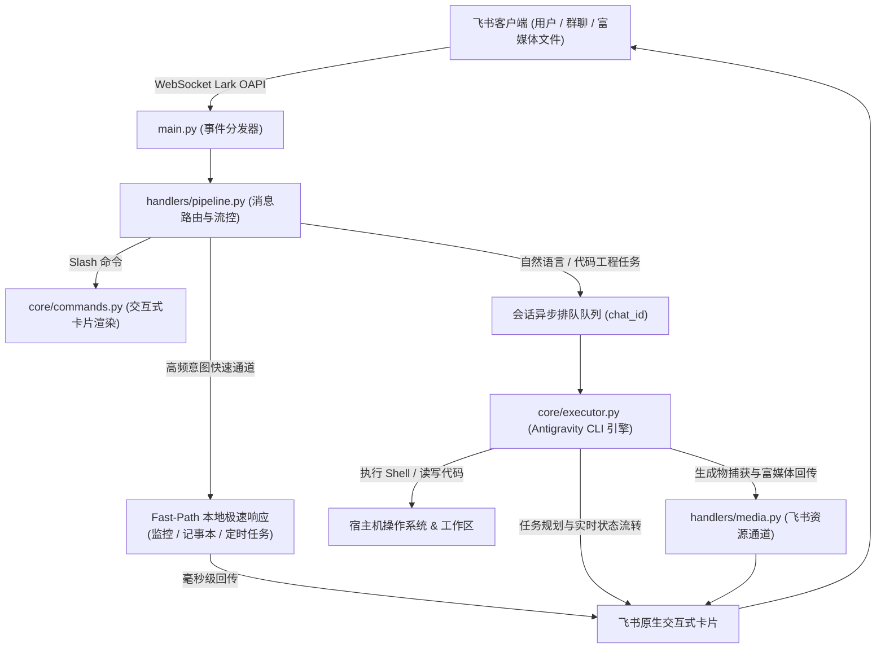

# 🚀 Antigravity Feishu Bot

<p align="center">
  
  
  
  
</p>

基于飞书原生 WebSocket 长连接与宿主机 `antigravity`（`agy`）核心引擎的企业级智能研发助手。

无需公网 IP 或 Webhook 回调地址，在飞书内即可直接远程驱动服务器完成全栈代码读写、智能终端命令执行、多模态富媒体深度解析、实时交互卡片流转与任务规划自动化执行。

---

## 🌟 核心特性与技术亮点

### 🧠 1. 毫秒级意图匹配与 Fast-Path 极速响应
- **高频场景极速 Fast-Path（< 200ms 秒回）**：
  - 针对服务器健康监控（`server_health`）、备忘笔记（`notes`）、定时任务计划（`cron`）等高频意图，系统直接在本地命中 Fast-Path 并在毫秒级回传交互卡片，免除等待大模型生成的延迟与 Token 开销。
- **任务规划流转（Task Planning Directive）**：
  - 对工程任务自动注入 `[TASK_PLAN]` 步骤流转并在飞书卡片中实时打勾 ✅。
  - 注入**自主执行防选择题准则**：遇到多技术分支时由 Agent 自动评估并选取最优方案推进，严禁向用户输出无意义的选择题。
  - 对轻量纯文本咨询模式禁用一切终端与文件写入工具，保障安全与极速响应。

### 🖥️ 2. 本地全栈开发与执行引擎
- **宿主机直驱**：依托本机 `agy` 引擎，支持在宿主机目录读写源码、安装依赖、调试构建与执行 Shell 脚本。
- **项目工作区隔离**：`/project` 呼出可视化项目管理器，支持多目录快速切换、新建工程空间、或直接输入 Git 仓库地址自动 Clone 并在飞书里即刻开发。
- **生成物智能捕获回传**：自动嗅探模型在执行过程中生成的图片、数据图表、Word、Excel、PDF 及压缩包，自动通过飞书富媒体通道安全回传。

### 💬 3. 原生卡片流转与异步会话管理
- **动态流转卡片**：从任务排队、资源加载、思考推理、步骤规划打勾、工具执行耗时追踪到最终交付，全生命周期原地刷新（In-place Patch）。
- **会话独立排队**：按 `chat_id` 维护独立异步任务队列，避免并发冲突；支持 `/stop` 随时紧急熔断中断任务。
- **上下文预热池（Prewarm Pool）**：内置会话预热守护机制，大幅削减大模型 CLI 初始化冷启动延迟。

### 📁 4. 多模态与文件解析交互
- **全格式下行多模态**：支持直接向机器人发送图片、PDF、Word 文档、代码文件、音视频文件，自动抽取并提供上下文分析。
- **本地原生插件生态**：支持挂载本地插件（服务器健康、备忘笔记、定时调度、AI 偏好记忆等），支持热重载。

---

## 📸 交互式原生卡片体验 (Interactive Card UI)

`agy-feishu` 采用全原生飞书交互式卡片流转，杜绝死板纯文本，提供直观的工程级全流程可视化交互：

### 1. 任务规划与实时动态打勾 (Task Execution & Roadmap)
> 任务执行过程中，卡片动态原地刷新（In-place Patch），实时展示多步任务规划打勾、工具调用与精准耗时：
```text
┌──────────────────────────────────────────────────────────┐
│ 🚀 正在处理工程任务: 优化数据库索引与连接池                 │
├──────────────────────────────────────────────────────────┤
│ 📋 任务执行路径规划:                                      │
│  ✅ 步骤 1: 扫描 SQLite 表结构与查询执行计划 (耗时 1.2s)    │
│  🔄 步骤 2: 正在执行: 添加复合索引并验证读写基准...        │
│  ⏳ 步骤 3: 等待执行: 生成性能分析报告与配置补丁           │
│                                                          │
│ 🛠️ 工具调用: bash (sqlite3 /data/app.db "EXPLAIN QUERY") │
│ ⏱️ 当前耗时: 3.4s | 模式: 深度思考 (Thinking: High)      │
├──────────────────────────────────────────────────────────┤
│ [ ⏹️ 紧急熔断中断 (/stop) ]    [ 🔄 刷新当前进展 ]        │
└──────────────────────────────────────────────────────────┘
```

### 2. 交互式模型控制台 (Model Switcher & Reasoning Effort)
> 支持一键热切换底层大模型及思考深度（Gemini / Claude / GPT 等），即刻生效无需重启服务：
```text
┌──────────────────────────────────────────────────────────┐
│ 🤖 大模型与思考深度控制台                                  │
├──────────────────────────────────────────────────────────┤
│ 当前生效模型: gemini-2.5-pro                              │
│ 当前思考深度: high (深度多步规划)                          │
│                                                          │
│ 快速切换基座模型:                                         │
│ [ ⚡ Gemini 2.5 Flash ]   [ 🧠 Gemini 2.5 Pro (当前) ]    │
│ [  Claude 3.7 Sonnet ]   [ GPT-4.5 Preview ]            │
│                                                          │
│ 思考推理深度调节:                                         │
│ [ 🟢 Low (轻量直出) ]  [ 🟡 Medium (标准) ]  [ 🔴 High ]  │
└──────────────────────────────────────────────────────────┘
```

### 3. 可视化工作区与会话接管 (Workspace & Conversation Manager)
> 支持在飞书端直接漫游宿主机项目目录、拉取 Git 仓库，或者一键接管本地终端历史会话：
```text
┌──────────────────────────────────────────────────────────┐
│ 📂 工作区项目管理器                                      │
├──────────────────────────────────────────────────────────┤
│ 当前工作区: /root/Documents/my-cloud-project             │
│ Git 分支: 🌿 main (Clean)                                │
│                                                          │
│ 常用项目列表:                                             │
│ 1. 📁 my-cloud-project (当前绑定)                        │
│ 2. 📁 agy-feishu-bot                                     │
│ 3. 📁 deeplearning-research                              │
│                                                          │
│ [ ➕ 新建工作区 ]   [ 🌐 克隆 Git 仓库 ]   [ 🔄 刷新目录 ]  │
└──────────────────────────────────────────────────────────┘
```

### 4. 账户额度与系统监控看板 (Quota & System Status)
> 实时通过宿主机 LSP 探测 Google AI Pro 剩余额度与宿主机负载指标：
```text
┌──────────────────────────────────────────────────────────┐
│ 📊 Google AI Pro / Antigravity 配额状态                   │
├──────────────────────────────────────────────────────────┤
│ 账号: developer@corp.com (Active)                        │
│ 剩余查询配额: 87.5% [████████████████░░]                  │
│ 重置周期: 每日 00:00 (距离重置剩余 8小时22分)              │
│                                                          │
│ 宿主机状态:                                              │
│ • CPU 负载: 12.4% (8 Core)   • 内存使用: 3.1 GB / 16 GB  │
│ • 会话缓存池: 3 Active       • 服务运行: 48小时16分      │
├──────────────────────────────────────────────────────────┤
│ [ 🔄 立即刷新配额 ]            [ ⚙️ 运维诊断信息 ]        │
└──────────────────────────────────────────────────────────┘
```

---

## ⌨️ 完整 Slash 指令列表

系统当前内置与插件注册的所有斜杠指令均已完成重构适配并经过严格验证，支持直接发送文本或通过卡片按钮交互触发：

### 1. 会话接管与大模型控制
| 指令 | 别名 / 子命令 | 权限级别 | 功能与交互说明 |
| :--- | :--- | :---: | :--- |
| `/menu` | `/commands`, `/cmds`, `/shortcuts` | 全部 | **⚡ 快捷指令中心**：按场景分组列出所有功能指令，全指令配备交互按钮，**点击即可原地直接生效** |
| `/help` | - | 全部 | 呼出交互式帮助大厅与全功能快捷操作入口 |
| `/conversations` | `/convs`, `/history`, `/conv` | 全部 | **会话管理面板**：浏览本地 Antigravity 历史会话并一键在飞书端接管 |
| `/continue` | `/resume` | 全部 | **极速接管**：直接接管宿主机上最近一次本地活跃终端交互会话 |
| `/attach <id>` | `/resume <id>`, `/load_conv <id>` | 全部 | **指定接入**：绑定指定会话（支持 8 位前缀如 `/attach 08de92d4` 或完整 UUID） |
| `/model` | `/card` | 全部 | **大模型控制台**：呼出大模型切换面板（Gemini / Claude / GPT 等系列一键热切换） |
| `/context` | - | 全部 | **上下文看板**：查看当前会话 Token 容量、占用水位与滑动窗口状态 |
| `/quota` | - | 授权用户 / 管理员 | **配额查询**：实时同步宿主机 LSP 探测 Google AI Pro / Antigravity 当前账户剩余配额 |
| `/clear` | - | 全部 | **清空上下文**：彻底清空当前会话记忆并热重置 Prewarm 进程池，开启全新对话 |
| `/stop` | - | 全部 | **紧急熔断**：叫停当前正在运行的后台任务，清空排队并打断正在执行的底层进程 |

### 2. 工作区与工程开发
| 指令 | 别名 / 子命令 | 权限级别 | 功能与交互说明 |
| :--- | :--- | :---: | :--- |
| `/project` | `/project [绝对路径]` | 全部 | **项目管理器**：无参数呼出可视化工作区面板（切换工程、新建项目、克隆 Git 仓库）；带参数直接绑定公共项目根目录 |

### 3. 随身工具与记忆库
| 指令 | 别名 / 子命令 | 权限级别 | 功能与交互说明 |
| :--- | :--- | :---: | :--- |
| `/health` | `/sysinfo` | 全部 | **服务器健康看板**：CPU 负载、内存占用、磁盘空间，Fast-Path 毫秒级秒回 |
| `/note` | `/notes`, `/note list` | 全部 | **记事本面板**：呼出随身笔记清单卡片 |
| `/note add <文本>` | `/note <文本>` | 全部 | 添加一条随身笔记，永久保存在当前会话中 |
| `/note del <编号>` | - | 全部 | 按笔记序号删除指定笔记 |
| `/note clear` | - | 全部 | 一键清空记事本中的所有笔记 |
| `/cron` | `/schedule` | 全部 | **定时任务中心**：管理用户周期任务与系统后台任务，支持倒计时与 Cron 表达式 |
| `/memory` | - | 全部 | **个人偏好记忆**：查看与管理用户的个性化偏好，支持交互式新增与单条擦除 |
| `/brain` | - | 全部 | **全局知识图谱**：透视 Antigravity 全局跨会话记忆与知识沉淀 |
| `/ping` | - | 全部 | **连通性探测**：测试网络与核心服务存活状态（秒回 Pong） |

### 4. 权限与系统运维（管理员专属）
| 指令 | 别名 / 子命令 | 权限级别 | 功能与交互说明 |
| :--- | :--- | :---: | :--- |
| `/status` | - | 管理员 | **系统状态看板**：查看 Bot 进程 Uptime、CPU/内存指标、重启计数与近期日志摘要 |
| `/plugin` | `/plugins` | 管理员 | **插件管理器**：查看已挂载插件、版本、注册指令，支持卡片式热重载 |
| `/plugin reload` | `/pluginreload` | 管理员 | 快速重新扫描并热重载 `plugins/` 目录下的所有插件 |
| `/update` | - | 管理员 | **OTA 升级探测**：对比云端与本地代码版本并展示待更新 Changelog |
| `/update confirm` | `/update force` | 管理员 | **执行升级重载**：自动执行 `git pull origin main` 并平滑重启服务 |
| `/user` | - | 管理员 | **权限管理面板**：可视化用户/群聊授权列表（支持翻页与授权档位调整） |
| `/user grant <id> [tier]` | - | 管理员 | 直接授权指定会话（档位可选：`basic` / `dev` / `full`） |
| `/user revoke <id>` | - | 管理员 | 撤销指定会话的授权 |
| `/user ban <id>` | `/user unban <id>` | 管理员 | 拉黑或解除拉黑指定会话 |
| `/user promote <id>` | `/user demote <id>` | 管理员 | 提升指定会话为管理员或降级为普通用户 |
| `/user reset-admin` | - | 管理员 | 重新将最高管理员绑定至当前会话（确认指令：`/user reset-admin confirm`） |
| `/auth` | - | 未授权会话 | **权限申请**：向系统管理员推送授权申请卡片（附带申请者信息与理由） |


---

## 🔐 权限与安全风控机制

1. **第一私聊自动提权（Auto-Admin）**：
   - 首次部署启动后，**首个向 Bot 发送私聊消息的用户将自动绑定为系统最高管理员**（群聊不可被自动绑定）。
2. **三档细粒度授权体系**：
   - 未授权会话默认保持静默，发送 `/auth` 后，管理员会收到包含申请者信息的审批卡片，支持一键审批：
     - **基础版（Basic）**：日常文本问答、记事本、简单查询。
     - **开发版（Dev）**：可使用项目切换、代码查看与受限工具。
     - **完全版（Full）**：具备终端 Shell 执行与宿主机全权限。
3. **系统级命令守卫与物理阻断**：
   - 对底层 `rm -rf /`、磁盘覆写、系统重启等高危指令进行物理级阻断；`--dangerously-skip-permissions` 仅对受信任的最高管理员生效。
4. **防刷限流（Rate Limiting）**：
   - 普通授权用户每分钟最多发送 5 条消息，每日上限 100 次工具执行（管理员不限）。

---

## 🚀 安装部署指南

### 环境要求
- **操作系统**：Linux (Ubuntu 20.04+ / Debian 11+ / CentOS / Arch)、macOS (Apple Silicon / Intel) 或 Windows (10/11, 原生或 WSL2)
- **Python**：Python 3.10+
- **守护管理**：Node.js & PM2（生产环境推荐：`npm install -g pm2`）或 Docker
- **底层引擎**：本机已安装并登录授权的 **Antigravity CLI**（`agy` 或 `antigravity`）

---

### 方法 1：一键脚本自动化安装（推荐）

#### 🐧 Linux / 🍎 macOS：
在终端执行：
```bash
bash <(curl -fsSL https://raw.githubusercontent.com/agentscope-gh/agy-feishu/main/install.sh)
```
脚本将自动引导您输入飞书凭据、创建虚拟环境、安装依赖并一键注册 PM2 开机自启。

本地已 Clone 代码时的一键运维：
```bash
chmod +x install.sh
./install.sh           # 交互式初始化与安装
./install.sh update    # 极速拉取并平滑重启
./install.sh uninstall # 彻底停止服务并清理
```

#### 🪟 Windows (PowerShell)：
在 PowerShell 中执行：
```powershell
irm https://raw.githubusercontent.com/agentscope-gh/agy-feishu/main/install.ps1 | iex
```
脚本将自动创建虚拟环境、安装依赖、引导配置 `.env` 并生成快捷启动脚本 `start.bat`。

---

### 方法 2：手动源码部署

```bash
# 1. 克隆代码仓库
git clone https://github.com/agentscope-gh/agy-feishu.git
cd agy-feishu

# 2. 创建并激活 Python 虚拟环境
python3 -m venv venv
source venv/bin/activate  # Windows: .\venv\Scripts\activate

# 3. 安装依赖包
pip install -r requirements.txt

# 4. 配置环境变量
cp .env.example .env
nano .env  # 填入飞书 FEISHU_APP_ID 与 FEISHU_APP_SECRET

# 5. 启动服务
# 方式 A：PM2 生产守护（推荐）
pm2 start venv/bin/python3 --name "agy-feishu-bot" -- main.py
pm2 save
pm2 startup

# 方式 B：直接前台运行
python3 main.py
```

---

### 方法 3：Docker / Docker Compose 部署

```bash
cp .env.example .env
# 编辑 .env 配置飞书凭据与挂载目录

docker compose up -d --build
```

---

## ⚙️ 完整环境变量配置指南

编辑项目根目录下的 `.env` 文件：

```env
# ==========================================
# 1. 飞书开放平台配置 (必填)
# ==========================================
FEISHU_APP_ID=cli_xxxxxxxxxxxx
FEISHU_APP_SECRET=xxxxxxxxxxxxxxxxxxxxxxxxxxxxxxxx

# ==========================================
# 2. 安全与白名单配置 (可选)
# ==========================================
# 允许访问的 open_id 或 chat_id，多个用英文逗号分隔；留空则由 /auth 授权机制管理
ALLOWED_USERS=
ALLOWED_CHATS=
# 是否向 agy 传递跳过权限确认标记 (默认 true，仅对管理员生效)
DANGEROUSLY_SKIP_PERMISSIONS=true

# ==========================================
# 3. Antigravity 引擎与工作区配置
# ==========================================
# agy 可执行文件绝对路径；留空则系统自动探测
ANTIGRAVITY_BIN=
# antigravity-cli 数据存储目录 (默认: ~/.gemini/antigravity-cli)
ANTIGRAVITY_HOME=
# 默认公共工作区根目录 (默认: ~)
WORKSPACE_ROOT=/home/ubuntu
# 默认大模型 (如: gemini-3.7-flash-low / gemini-3.8-flash-high / claude-sonnet-4-6)
DEFAULT_MODEL=gemini-3.7-flash-low
```

---

## 📋 飞书开放平台后台配置（极简 4 步）

1. **开启 WebSocket 长连接模式**：
   - 登录 [飞书开放平台](https://open.feishu.cn/)，进入创建的企业自建应用。
   - 打开 **开发配置 → 事件与回调**（或“事件订阅”），将接收方式切换为 **WebSocket 长连接**（无需填写公网 URL）。
2. **开通必要权限（权限管理）**：
   - `im:message`（获取与发送单聊、群组消息）
   - `im:message:resource`（获取消息中的图片、富文本与音视频资源）
   - `im:image`（上传图片）
   - `im:file`（上传本地文件与生成物）
   - `im:message.reaction`（消息表情回复状态标记）
   - `im:chat:readonly`（读取群聊名称）
   - `contact:user.base:readonly`（读取用户飞书昵称）
3. **订阅核心事件**：
   - 添加事件：`im.message.receive_v1`（接收消息事件）
   - 卡片动作回调：`card.action.trigger`（自动支持，无需额外权限）
4. **发布应用版本**：
   - 确认并在 **版本管理与发布** 中创建新版本并发布，确保你的飞书账号位于应用的**可用范围**内。

---

## 🏗️ 核心系统架构



---

## 📂 模块化分层架构 (Modular Architecture)

项目遵循严谨的软件工程解耦原则，各模块职责清晰，边界明确：

```
agy-feishu/
├── core/                  # 核心执行引擎与生命周期治理
│   ├── executor.py        # Antigravity CLI 直驱引擎与流控
│   ├── session_pool.py    # 会话持久化与上下文缓冲池
│   ├── commands.py        # Slash 命令解析与分发器
│   ├── app_state.py       # 异步事件循环与并发执行池
│   └── garbage_collection.py # 僵尸进程回收与存储清理
├── client/                # 飞书平台通信与媒介集成
│   ├── lark_client.py     # Lark OpenAPI 客户端封装
│   ├── multimodal.py      # 富媒体与生成物自动上传回传
│   └── send_to_feishu.py  # 异步消息回发管道
├── storage/               # 数据存储与持久化层
│   └── database.py        # SQLite 连接池、权限与会话管理
├── cards/                 # 飞书原生交互式卡片体系
│   ├── locales.py         # 集中化多语言与高信噪比文案配置
│   ├── indicators.py      # 任务规划大纲与动态阶段看板
│   └── stats_cards.py     # 配额与 Token 上下文监控看板
├── plugins/               # 动态插件化扩展系统
│   ├── base.py            # BasePlugin 抽象基类与生命周期 Hook
│   ├── manager.py         # 插件扫描、注册与热重载管理器
│   ├── cron_engine.py     # 计划任务独立守护引擎
│   └── [plugins]          # 独立插件目录 (巡检、记事本、AI记忆等)
├── handlers/              # 飞书事件、消息与卡片回调路由管线
├── utils/                 # 系统工具库 (跨平台适配、RBAC、Token统计)
├── main.py                # 服务启动引导与 WebSocket 监听入口
└── tests/                 # 自动化测试套件 (包含多模块全量用例)
```

---

## 🛠️ 常用运维排错命令

```bash
# 查看主程序实时运行日志
pm2 logs agy-feishu-bot

# 检查进程状态与内存占用
pm2 status

# 重启飞书机器人服务
pm2 restart agy-feishu-bot

# 停止服务
pm2 stop agy-feishu-bot
```

---

## 📄 开源许可证

本项目基于 [Apache License 2.0](LICENSE) 协议开源。

---

## 🙏 致谢与鸣谢 (Acknowledgments)

- **[Google Antigravity](https://github.com/google)**：提供强大的底层 Agentic Coding 引擎与 CLI 工具支持。
- **[Lark Open Platform / lark-oapi](https://open.feishu.cn/)**：提供稳定高效的飞书开放平台 SDK 与 WebSocket 长连接基座。
- 感谢开源社区早期各类飞书机器人探索与启发。本项目基于全新 Cleanroom 架构设计，遵循严格的软件工程、安全沙箱与多平台生产规范重构。
